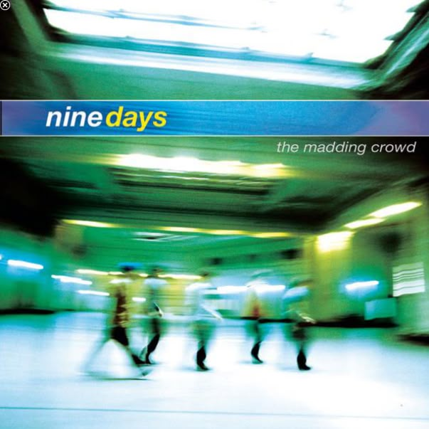
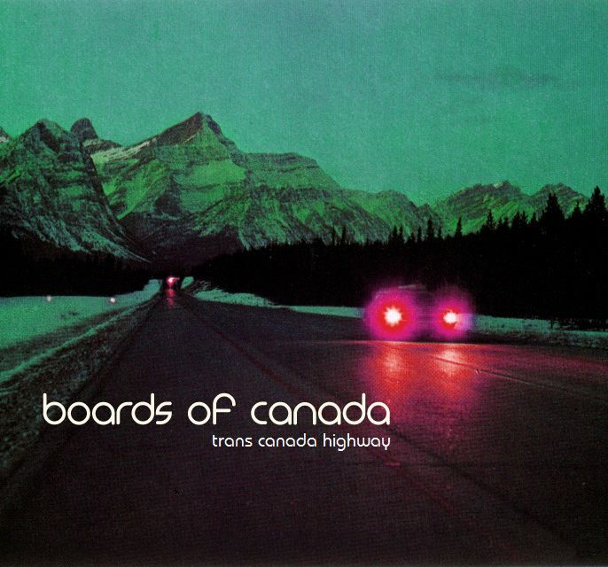
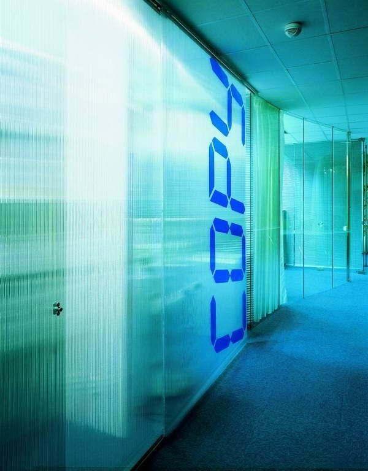

# la euphoria
# **LA EUPHORIA: ESCAPE TO PARADISE - CD2 YOUTUBE VISUALISER (CITY/REALITY) BRIEF**  
━━━━━━━━━━━━━━━━━━━━━━━━━━━━━━━━━━  

### **THEME**  






**CD2 = "Reality" after paradise.**  
- Think: **Gritty, moody, neon-lit cities, rain-soaked streets, urban decay, nostalgia, shadows.**
- Motion blur, long exposure, grain+noisy textures
- **Avoid**: Tropical/beachy vibes (those are for CD1).  

---

### **DELIVERABLES**  

#### **1. CD2 YOUTUBE VISUALISER VIDEO TO MATCH CD 2 AUDIO MIX**  
- **Audio Mix**: [Google Drive Link](https://drive.google.com/drive/folders/1vdr_XBd6Ggp3doJg02zxIm8SoinshxpT?usp=sharing)  
- **Format**: 1920x1080 Video .mp4  
- **Runtime**: ~40 minutes (use **looping motifs**, subtle stock footage).  
- **Mood**: Surreal, retro-futuristic, liminal spaces, cityscapes.  
- **Deadline**: ~20th June 2025.  

#### **2. TEXT OVERLAY FOR VISUALISER**  
- **Fonts**: [Here](https://drive.google.com/drive/folders/1Wirhm_DHQ5PY3Wxa79wtOqSSgvLvR-ZZ?usp=sharing) are the fonts that will be used. You can also use Helvetica Light 45 or Black 95
- **Primary Text**: `[ARTIST NAME]`, `[TRACK NAME]` (synced to track).  
- **Secondary Text**: Smaller `[LA EUPHORIA - ESCAPE TO PARADISE]`, `[TRACK #]`, `[CD #]`.  
- **Deadline**: ~20th June 2025.  

---

### **DISC 2 TRACKLIST**  
```  
10. ortisei - b2l  
11. CITYSPROBLEM - Finality  
12. eternalBlue - Quantum Tool  
13. GOD SHOULD HAVE KNOWN - IF THIS IS THE END, LET US ALL ASCEND  
14. CYNTHESZR - Liftoff  
15. nabii - LEAVE IT ALL BEHIND  
16. beansclub - everchanging life without a clue  
```  

---

### **REFERENCES**  
- **CD2 Cover Art**: [Download](https://drive.google.com/file/d/16_FzW31O_8qo57hlG1qrp1uTZreh29iT/view?usp=sharing)  
- **CD2 Video References**: [YouTube Playlist](https://youtube.com/playlist?list=PLVXGw95H43O2IlaFi6O0LEVaccvG3IrXy&si=YaAE10-HqlZBDlaq)  
- **CD1 Visualiser Example**: [Video](https://youtu.be/whXnJarDuNY)  
- **CD1 Pinterest**: [Link](https://au.pinterest.com/dwams1/la-euphoria-comp-1-part-1-visuals/)  
- **CD2 Pinterest**: [Link](https://au.pinterest.com/earthangelbaby6000/la-euphoria-comp-1-part-2-visuals/)  
- **Trailer (CD2 Section)**: [YouTube Short](https://youtube.com/shorts/LypUqu_TIng)  


### **RESOURCES** 
- **STOCK VIDEO SITES**: https://www.pexels.com/, http://pixabay.com/, https://unsplash.com/
- **SAMPLING**: We encourage sampling, just make sure you add some effects / manipulate it to make it your own!
- **TUMBLR AESTHETIC PAGES** https://www.tumblr.com/y2kaestheticinstitute, https://icydreamin.tumblr.com/ (@taffa :D), https://genxyac.tumblr.com/

---

### **NOTES**  
- Deadlines are flexible—just communicate delays.  
